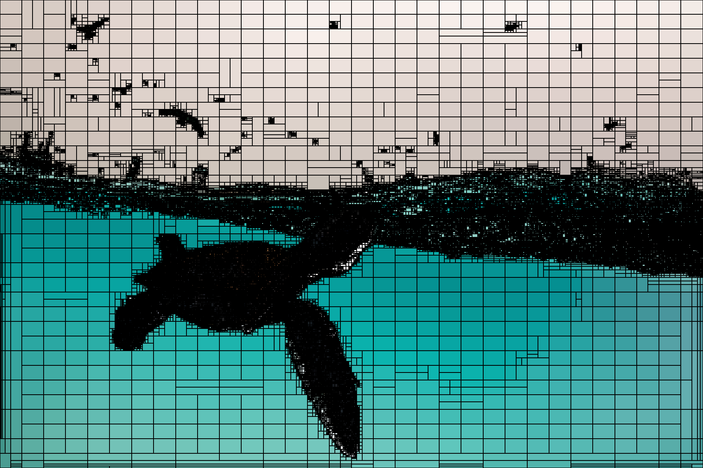
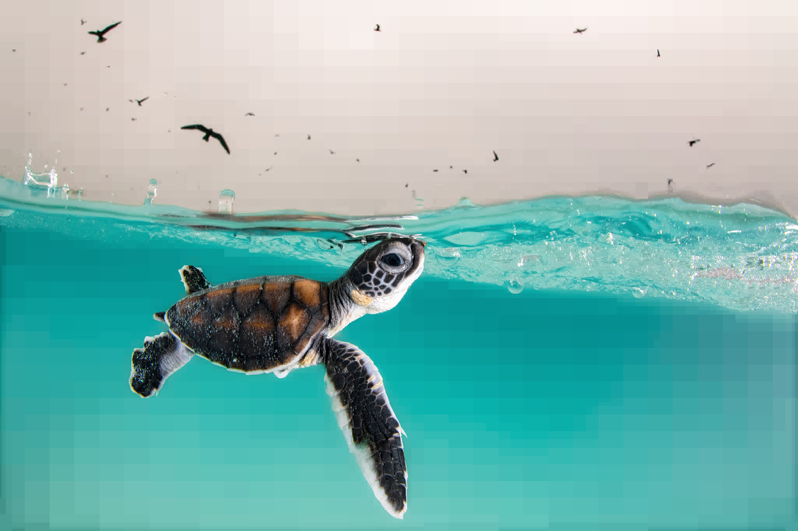

# Disage

Image segmentation and discretization using [image-rs](https://github.com/image-rs)



## Code example

```
use disage::DiscreteImage;
use image;

fn main() {
    let img = image::open("../disage/assets/input.png")
        .unwrap()
        .to_rgb16();
    let disage = DiscreteImage::new(&img);

    println!(
        "Input pixels: {}\nDiscrete pixels: {}",
        img.pixels().count(),
        disage.pixels.len()
    );

    let img_out = disage.collect();
    image::DynamicImage::ImageRgb16(img_out)
        .to_rgb8()
        .save("../disage/assets/output.png")
        .unwrap();

    let img_with_borders = disage.collect_with_borders(Some(image::Rgb::<u16>([0; 3])));
    image::DynamicImage::ImageRgb16(img_with_borders)
        .to_rgb8()
        .save("../disage/assets/output_with_borders.png")
        .unwrap();
}
```
## Work example

Input : 


Output :

