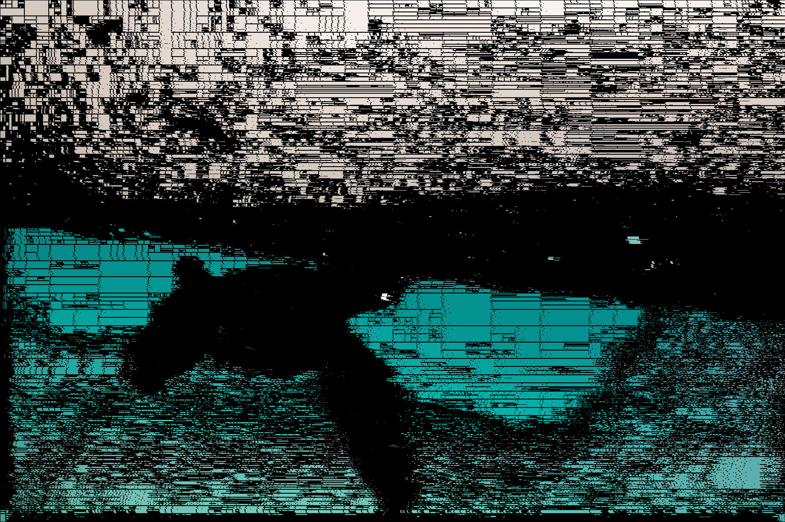

# Disage

Image segmentation and discretization. Fully relying on [image-rs](https://github.com/image-rs)

## Code example

```
let img = image::io::Reader::open("inputs/test.png")
    .unwrap()
    .decode()
    .unwrap()
    .to_rgb8();
let hasher = disage::hashers::MeanBrightnessHasher{};
let equality_checker = disage::checkers::BrightnessChecker{precision : [1,3,5]};
let discrete = disage::rgb_discrete(&img, hasher, equality_checker, (5,20));
println!("Pixels left : {}, compression : {}", discrete.group_count(), discrete.compression());
let pix_arr = discrete.clone().collect();
let output_img = disage::converters::to_rgb8(&pix_arr);
output_img.save("./outputs/test.jpg").unwrap();
disage::converters::to_rgb8(&discrete.collect_with_borders([0,0,0])).save("./outputs/test_borders.jpg").unwrap();
```
## Work example

Input : 


Output :


We can add borders to check how it was splitted :
